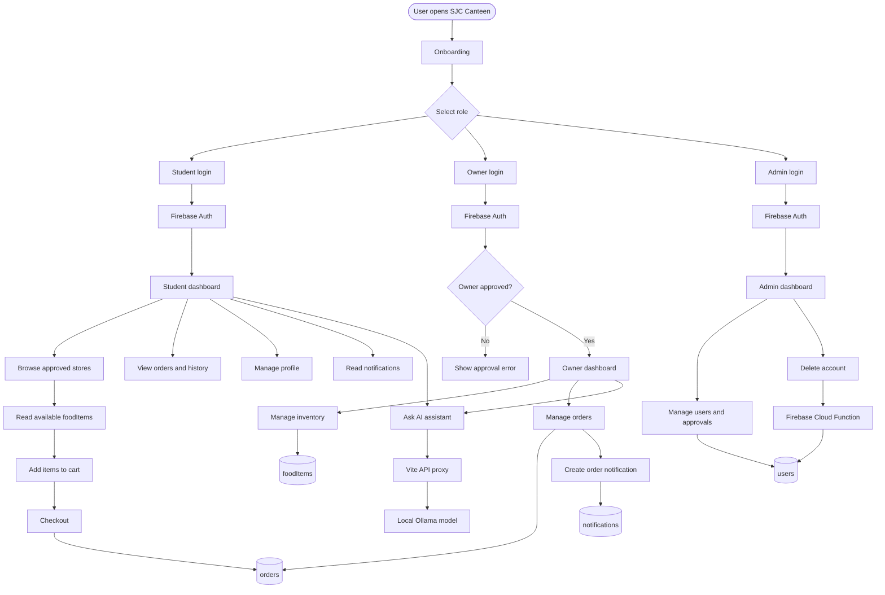
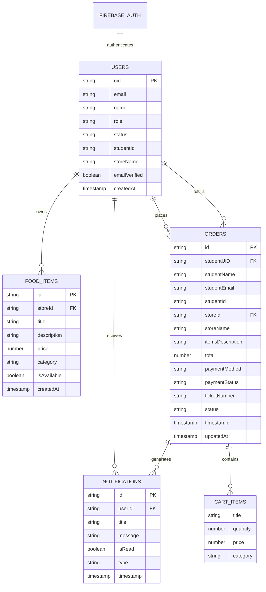

# SJC Canteen System Flowchart

```mermaid
flowchart TD
	START([User opens SJC Canteen]) --> ONBOARD[Onboarding]
	ONBOARD --> ROLE{Select role}
	ROLE --> STUDENT_LOGIN[Student login]
	ROLE --> OWNER_LOGIN[Owner login]
	ROLE --> ADMIN_LOGIN[Admin login]
	STUDENT_LOGIN --> STUDENT_AUTH[Firebase Auth]
	STUDENT_AUTH --> STUDENT_HOME[Student dashboard]
	STUDENT_HOME --> STORES[Browse approved stores]
	STORES --> FOOD[Read available foodItems]
	FOOD --> CART[Add items to cart]
	CART --> CHECKOUT[Checkout]
	CHECKOUT --> ORDERS[(orders)]
	STUDENT_HOME --> STUDENT_ORDERS[View orders and history]
	STUDENT_HOME --> PROFILE[Manage profile]
	STUDENT_HOME --> NOTIFICATIONS[Read notifications]
	OWNER_LOGIN --> OWNER_AUTH[Firebase Auth]
	OWNER_AUTH --> OWNER_APPROVAL{Owner approved?}
	OWNER_APPROVAL -->|No| OWNER_ERROR[Show approval error]
	OWNER_APPROVAL -->|Yes| OWNER_HOME[Owner dashboard]
	OWNER_HOME --> INVENTORY[Manage inventory]
	INVENTORY --> FOOD_ITEMS[(foodItems)]
	OWNER_HOME --> OWNER_ORDERS[Manage orders]
	OWNER_ORDERS --> ORDERS
	OWNER_ORDERS --> NOTIFY[Create order notification]
	NOTIFY --> NOTIFICATIONS_COLLECTION[(notifications)]
	ADMIN_LOGIN --> ADMIN_AUTH[Firebase Auth]
	ADMIN_AUTH --> ADMIN_HOME[Admin dashboard]
	ADMIN_HOME --> USERS[Manage users and approvals]
	USERS --> USER_COLLECTION[(users)]
	ADMIN_HOME --> DELETE[Delete account]
	DELETE --> FUNCTION[Firebase Cloud Function]
	FUNCTION --> USER_COLLECTION
	STUDENT_HOME --> ASK[Ask AI assistant]
	OWNER_HOME --> ASK
	ASK --> PROXY[Vite API proxy]
	PROXY --> OLLAMA[Local Ollama model]
```

# SJC Canteen Database ERD

```mermaid
erDiagram
	FIREBASE_AUTH ||--|| USERS : authenticates
	USERS ||--o{ FOOD_ITEMS : owns
	USERS ||--o{ ORDERS : places
	USERS ||--o{ ORDERS : fulfills
	USERS ||--o{ NOTIFICATIONS : receives
	ORDERS ||--o{ NOTIFICATIONS : generates
	ORDERS ||--o{ CART_ITEMS : contains
	USERS {
		string uid PK
		string email
		string name
		string role
		string status
		string studentId
		string storeName
		boolean emailVerified
		timestamp createdAt
	}
	FOOD_ITEMS {
		string id PK
		string storeId FK
		string title
		string description
		number price
		string category
		boolean isAvailable
		timestamp createdAt
	}
	ORDERS {
		string id PK
		string studentUiD FK
		string studentName
		string studentEmail
		string studentId
		string storeId FK
		string storeName
		string itemsDescription
		number total
		string paymentMethod
		string paymentStatus
		string ticketNumber
		string status
		timestamp timestamp
		timestamp updatedAt
	}
	CART_ITEMS {
		string title
		number quantity
		number price
		string category
	}
	NOTIFICATIONS {
		string id PK
		string userId FK
		string title
		string message
		boolean isRead
		string type
		timestamp timestamp
	}
```
